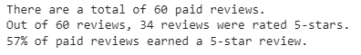
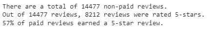

# Amazon Vine Analysis
## Overview of the Analysis
The project attempts to analyze the Amazon reviews written by members of paid program, Amazon Vine.

## Results

* There were only 60 paid reviews while there were 14,477 non-paid reviews. 

* Of 60 paid reviews, 34 reviews earned 5-stars; 8,212 reviews earned 5-stars out of 14,477 non-paid reviews.

* 57% of both Vine and non-paid reviews earned 5-stars.

## Summary
Looking just at the percentage of 5-star reviews earned by Vine and non-vine users, there is no positive bias on reviews by Vine users. If further analysis on all varying starred reviews (1-star, 2-star, etc) were done, then it'll be better support the hypothesis that Vine has no positive bias on product reviews.